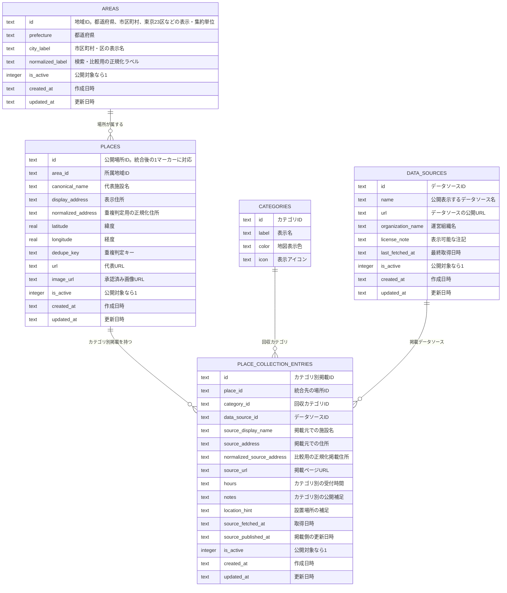

# Normalized Place Collection Model

## 目的

公開DBでは、カテゴリごとの掲載行をそのままマーカーにしない。実在する回収場所を `places` にまとめ、カテゴリ別の掲載元情報を `place_collection_entries` に分けて保持する。

## Mermaid

## 方針

- `places` はマーカーの粒度。1つの実在場所は1行にまとめる。
- `place_collection_entries` はカテゴリと掲載元の粒度。住所や施設名の表記揺れはここに残せる。
- `data_sources` は旧 `collectors` より意味が広く、自治体ページや業界団体リストも扱う。
- `dedupe_key` は統合候補を安定して再現するためのキー。公開APIには出さない。
- `confidence` は使わない。判断が必要な行は private pipeline 側の review status/reason で管理する。
